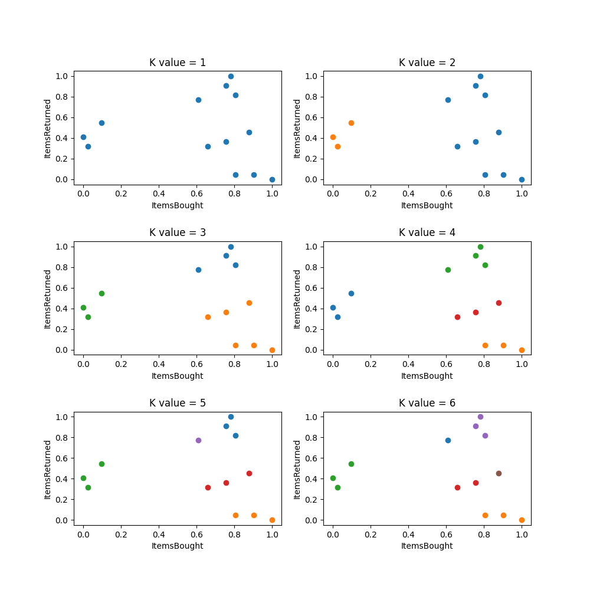
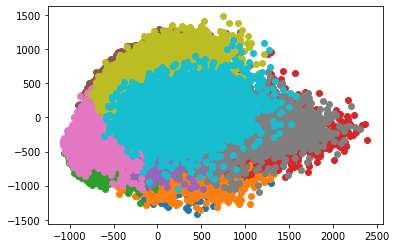
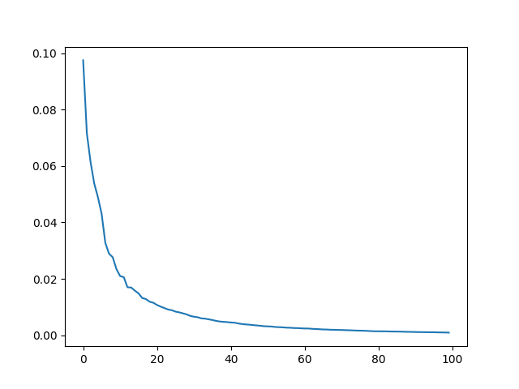
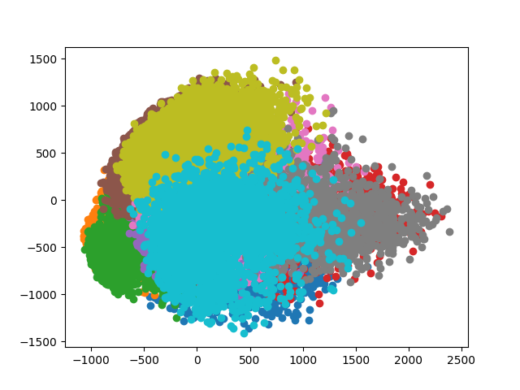

# 🗂 5주차 군집 알고리즘
## 📒 이론 문제 1

**다음 중 KMeans에 관한 질문 중 틀린 것을 고르시오.**
**답: 3**

	1. k-평균 알고리즘(K-means clustering algorithm)은 주어진 데이터를 k개의 클러스터로 묶는 알고리즘이다.
	2. KMeans는 각 클러스터와 거리 차이의 분산을 최소화하는 방식으로 동작한다.
	3. KMeans는 클러스터 개수인 k값을 지정해주지 않아도 동작할 수 있다.
	4. 엘보우 방법은 클러스터 개수를 늘려가면서 이너셔의 변화를 관찰하여 최적의 클러스터 개수를 찾는 방법이다.
	5. max_iter는 k-평균 알고리즘의 한 번 실행에서 최적의 센트로이드를 찾기 위해 반복할 수 있는 최대 횟수입니다.
3.KMeans는 클러스터 개수인 k값을 지정해주어야 작동한다. 추가적으로 실전에서 KMeans 값을 알기 어렵다는 점을 해결하기 위해 엘보우 방법을 사용한다

## ⚔ 실습 문제 2
**혼공이는 이번에 배운 KMeans를 실습하고자 한다. MinMaxScaler()를 이용해서 전처리를 진행한 후 ItemsBought과 ItemsReturned로 클러스터링을 하려고 한다. 반복문을 이용하여 여러 k값을 넣어 아래의 그래프를 만들었다.**
[CustomerDataSet.csv](https://s3-us-west-2.amazonaws.com/secure.notion-static.com/2f5c926a-4845-4d32-bd15-c1c33ab3efb3/CustomerDataSet.csv)

----------

```python
from google.colab import files
uploaded = files.upload()

import pandas as pd
import io
data = pd.read_csv(io.StringIO(uploaded['CustomerDataSet.csv'].decode('utf-8')))

```
**출력**

다음과 같이 KMeans 클래스를 이용해 k값을 여러개 넣어 확인해주세요.

----------

**답안**
```python
import matplotlib.pyplot as plt
from sklearn.preprocessing import MinMaxScaler
from sklearn.cluster import KMeans

customer = data[['ItemsBought', 'ItemsReturned']]

scaler = MinMaxScaler()
customer_scaled = scaler.fit_transform(customer)

f, axs = plt.subplots(3, 2, figsize=(10, 10))
plt.subplots_adjust(wspace=0.2, hspace=0.5)

for i in range(3):
  for j in range(2):
    k = 2*i+j+1
    km = KMeans(n_clusters=k)
    km.fit(customer_scaled)

    for w in range(k):
      axs[i, j].scatter(customer_scaled[km.labels_ == w, 0], customer_scaled[km.labels_ == w, 1])

    axs[i, j].set_title("K value = %d"%k)
    axs[i, j].set_xlabel("ItemsBought")
    axs[i, j].set_ylabel("ItemsReturned")

plt.show()

```



## 📒 이론 문제 3

**다음 중 PCA에 대해 틀린 것을 모두 고르시오.**
**답: 2,3**

	1. PCA는 고차원의 데이터를 저차원의 데이터로 요약해주는 방법이다.
	2. PCA는 중요한 변수를 구분하지 못한다는 단점이 있다.
	3. PCA는 computation cost가 낮아 사용하기 좋다.
	4. principal component는 많은 변수의 분산방식의 패턴을 간결하게 ‘표현’하는 것이다.
	5. PCA는 원래 변수들의 선형결합으로 이루어지는 새로운 변수들을 만든다.

2. 주성분분석에서 주성분은 일반적으로 원본 특성(feature)의 갯수 만큼 찾을 수 있다. 이 때 찾아낸 주성분을 이용하여 어떤 변수가 중요한 변수인지 판별할 수 있다.

3. 분산을 최소화하는 벡터를 찾을 때까지 계산을 반복해야 하기 때문에 차원이 높아질수록 필요한 계산력 또한 기하급수적으로 늘어난다. ⇒ computation cost(계산 비용)이 높다.

## ⚔ 실습 문제 4

[number.csv](https://s3-us-west-2.amazonaws.com/secure.notion-static.com/0720efca-b386-4152-894f-073dccef99cb/number.csv)

데이터로 주어진 파일 number.csv는 숫자 0 ~ 9 까지의 필기체 사진 42,000개를 28 x 28 픽셀로 (샘플 개수, 너비x높이)의 배열로 나타낸 것이다.

**아래의 단계 순서로 클러스터링을 해보자.**
1.  데이터를 불러오기
2.  주성분을 100개로 설정하고, PCA를 실행하기
3.  설정된 주성분을 그래프로 그려보기
4.  차원 축소된 데이터를 사용해 KMeans 알고리즘으로 클러스터 찾아보기
5.  클러스터별 이미지 출력해서 확인해보기 ( 코드 안에만 작성하시면 됩니다 ! )
6.  클러스터별 산점도 출력하기



**답안**
```python
import matplotlib.pyplot as plt
import pandas as pd
from sklearn.cluster import KMeans
from sklearn.decomposition import PCA

def draw100Images(img):
  n = len(img)
  fig, axs = plt.subplots(10, 10)

  for i in range(10):
    for j in range(10):
      index = 10*i + j
      if index < n:
        axs[i, j].imshow(img[index], cmap='gray_r')
      axs[i, j].axis('off')
  plt.show()

# 1. 데이터 불러오기
data = pd.read_csv('number.csv').to_numpy()

# 2. 주성분 분석, 3.+이미지 
pca = PCA(n_components=100)
pca.fit(data)
data_pca = pca.transform(data)
plt.plot(pca.explained_variance_ratio_)
plt.show()

# 4. 클러스터 찾아보기
km = KMeans(n_clusters=10)
km.fit(data_pca)

# 5. 100개 이미지 출력
for i in range(10):
  img = data[km.labels_ == i].reshape(-1, 28, 28)
  draw100Images(img)

# 6. 클러스터 산점도
for i in range(10):
  pick = data_pca[km.labels_ == i]
  plt.scatter(pick[:, 0], pick[:, 1])
plt.show()

```

 